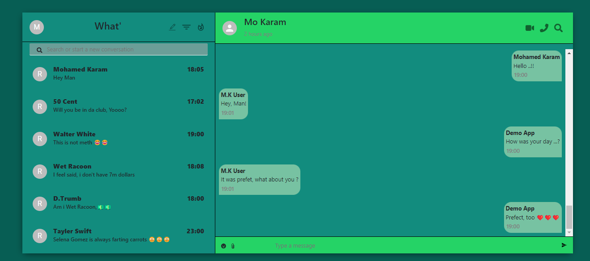

# WhatsApp Clone


This is a WhatsApp clone built using MERN (MongoDB, Express.js, React, Node.js) technologies with Firebase for authentication (Auth) and OAuth.

## Features

- **Real-time Messaging**: Send and receive messages in real-time.
- **Group Chat**: Create and join group chats with multiple participants.
- **Authentication**: Sign in with email/password or using OAuth providers (Google, Facebook, etc.) via Firebase Authentication.
- **User Profiles**: Customize your profile with a display name and profile picture.
- **Responsive Design**: The app is optimized for various screen sizes, including desktop and mobile devices.

## Technologies Used

- **Frontend**: React.js, Firebase Authentication
- **Backend**: Node.js, Express.js, MongoDB (using Mongoose)
- **Authentication**: Firebase Authentication (for email/password authentication and OAuth)
- **Real-time Messaging**: Pusher (for real-time communication)
- **Styling**: CSS

## Installation

1. Clone the repository:

   ```bash
   git clone https://github.com/MO-Karam-007/WhatsApp-Clone.git
   ```

2. Navigate to the project directory:

   ```bash
   cd WhatsApp-Clone
   ```

3. Install dependencies for both the frontend and backend:

   ```bash
   npm install
   ```

4. Set up Firebase Authentication:

   - Create a Firebase project and enable Firebase Authentication.
   - Add your Firebase configuration to the frontend code.
   - Set up OAuth providers (if needed) and configure them in Firebase.

5. Start the frontend development server:

   ```bash
   npm start
   ```

   The app will be running at `http://localhost:3000`.

## Usage

1. Sign in with your email/password or using OAuth providers via Firebase Authentication.
2. Start a new conversation by selecting a contact or create/join a group chat.
3. Send messages, and engage in real-time conversations.
4. Customize your profile settings and manage your contacts.

## Contributing

Contributions are welcome! If you find any issues or have suggestions for improvements, please feel free to open an issue or submit a pull request.